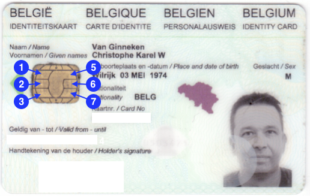

# Embedded eID
An experiment to implement a minimalistic embedded library to read (Belgian) eID smart cards.  
Christophe VG <<contact@christophe.vg>>

## Introduction

This repository holds all information, designs and software collected while investigating the possibility to access a (Belgian) eID smart card from an embedded system, e.g. an Arduino,...

This means we don't have access to a full-blown card-reader, like [ACR38U](http://www.acs.com.hk/en/products/199/acr38u-i1-smart-card-reader/) or the likes, nor a PC or Mac to run some bloated Java-based middleware/runtime/... on top of some OS-based smart card driver infrastructure and so on.

The fact that it took me more than a few hours to find some basic protocol information on how to access it, proves the bad state of affaires. Soon, I hope, this repository will show that it doesn't have to be this way, and that accessing (Belgian) eID smart cards is simple and can be done in a fully transparant way. We'll see ;-)

## First Steps

### Finding Information/Existing Work

* [https://github.com/Fedict/eid-mw](https://github.com/Fedict/eid-mw) - Home of the eID Middleware
* [https://sourceforge.net/projects/arduinosclib/](https://sourceforge.net/projects/arduinosclib/) - Actively maintained Arduino Smart Card access library
* [https://www.makomk.com/2011/02/25/iso-7816-smartcard-interface-for-arduino/](https://www.makomk.com/2011/02/25/iso-7816-smartcard-interface-for-arduino/) - An Arduino Sketch to access ISO-7816-based smart cards
* [https://www.foo.be/eID/opensc-belgium/](https://www.foo.be/eID/opensc-belgium/) - Older information, back from in the days when the information was much more straightforward and transparant.
* [http://homes.esat.kuleuven.be/~decockd/site/EidCards/belpic/mySlides/belgian.eid.card.technical.overview.pdf](http://homes.esat.kuleuven.be/~decockd/site/EidCards/belpic/mySlides/belgian.eid.card.technical.overview.pdf) - A presentation giving a holistic overview and some technical information.
* [https://en.wikipedia.org/wiki/ISO/IEC_7816](https://en.wikipedia.org/wiki/ISO/IEC_7816) - Wikipedia page on the ISO-7816 specification
* [https://www.maximintegrated.com/en/app-notes/index.mvp/id/4029](https://www.maximintegrated.com/en/app-notes/index.mvp/id/4029) - Detailed application note on low-level access methods to smart cards

### Wiring

A Smart Card consists of a very small chip and (in theory) eight (8) pads/contacts:

| Contact | Function                     |
| ------- | ---------------------------- |
| 1       | Supply voltage to card (VCC) |
| 2       | Reset (RST)                  |
| 3       | Clock (CLK)                  |
| 4       |                              | 
| 5       | Ground (GND)                 |
| 6       | VPP                          |
| 7       | Input/Output (I/O)           |
| 8       |                              |

Only 6 of them are actually in use, which makes the eID smart card pad-compliant with the [Europay/Matercard/Visa (EMV)](https://en.wikipedia.org/wiki/EMV) technical standard.

### Getting a First Answer ... To Reset

Smart Cards that conform to [ISO/IEC 7816(-10)](https://en.wikipedia.org/wiki/ISO/IEC_7816#7816-10:_Electronic_signals_and_answer_to_reset_for_synchronous_cards) respond to a reset signal with the so called ATR: the [Answer To Reset](https://en.wikipedia.org/wiki/Answer_to_reset). The ATR is a sequence of bytes that 1) confirms that the smart card is operational and 2) contains information about how to continue the dialog between smart card and the interfacing device.

According to [this old document about eID reader specifications](https://www.foo.be/eID/opensc-belgium/BEID-ReaderSpecs-v2.7.5.pdf) the ATR should look like:

| TS  | T0 | TA1| TB1 | TC1 | TD1 | TA2| TB2 | TC2 | TD2 | TA3| TB3 | TC3 | TD3 |
| --- | --- | --- | --- | --- | --- | --- | --- | --- | --- | --- | --- | --- | --- |
| 3b  | 98  | 94  | 40  | 0a  | ff  | a5  | 03  | 01  | 01  | 01  | ad  | 13  | 10  |

The initial byte (TS) defines how to proceed with the interpretation of the ATR bytes. In this case, `3b` means _direct convention_ and the bit-pattern observed on the `I/O` pad looks like: `(H) L H H L H H H L L H (H)`.

The `I/O` pad is by default `high`, and each byte transmission starts with a `low`, followed by 8 bits (least-significant bit first) and 1 additional parity bit. The parity bit is high or low and ensures that the total number of high bits is even. So in this case the 8 data bits are : `H H L H H H L L`, inverted they represent `0011 1011` or indeed `3b`.

To be continued...

